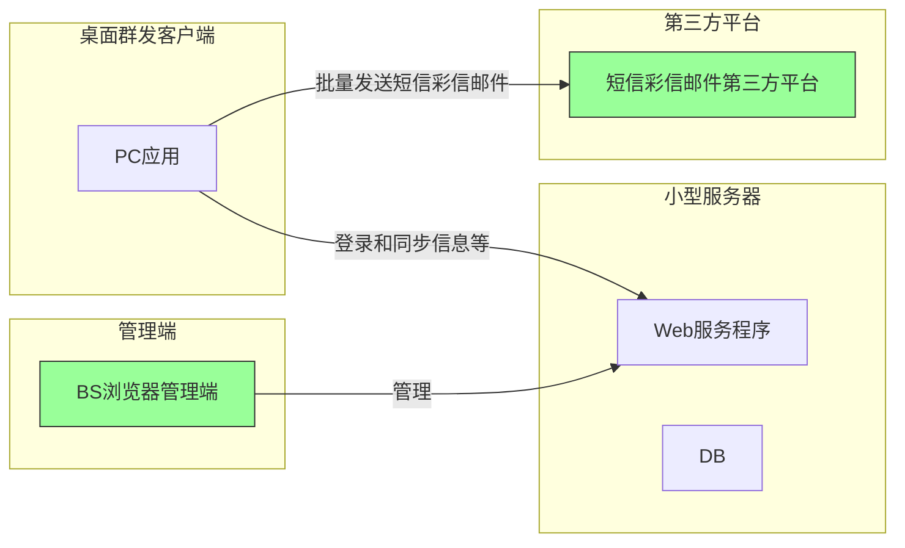
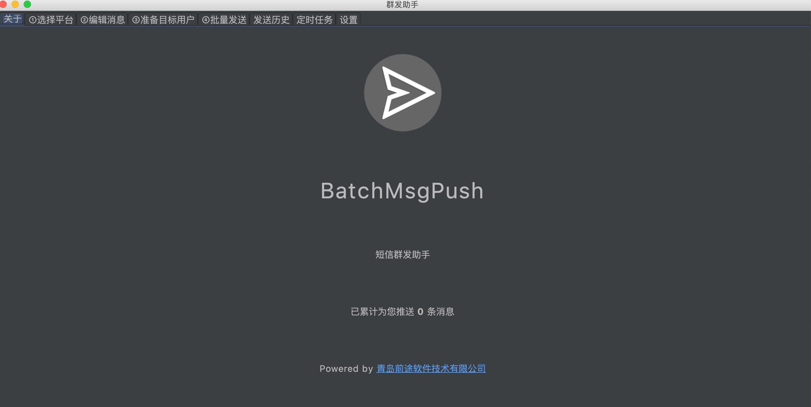
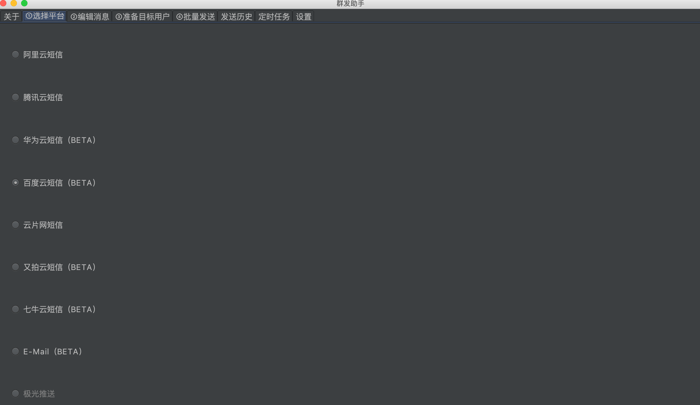
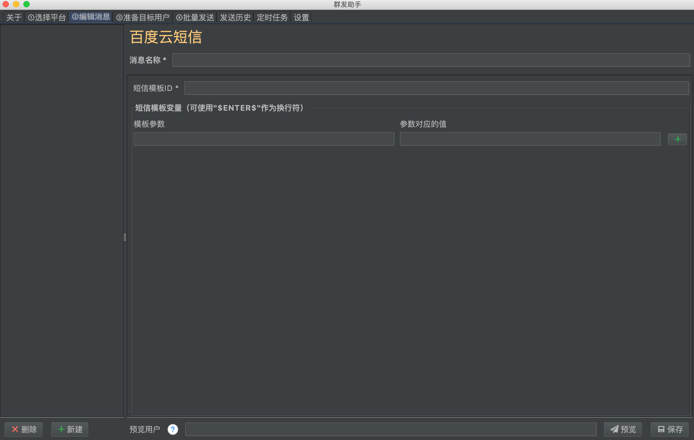
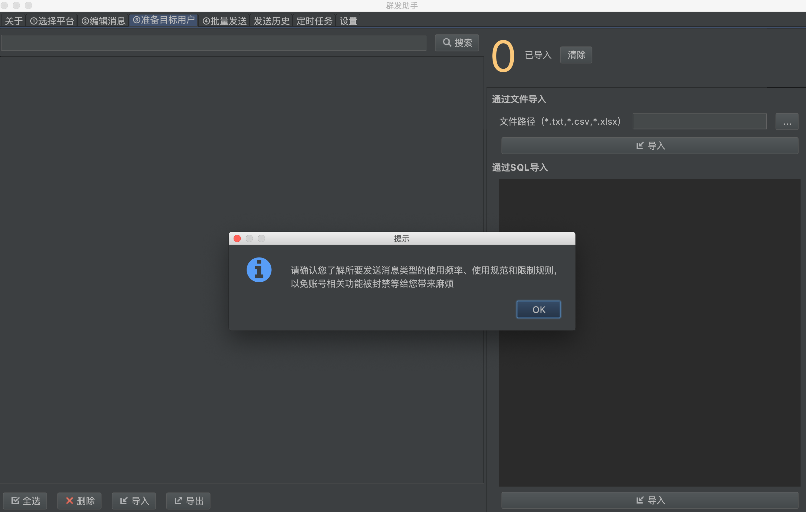
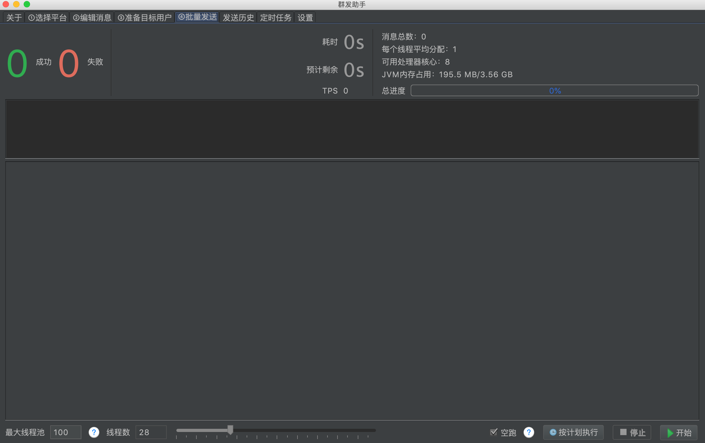
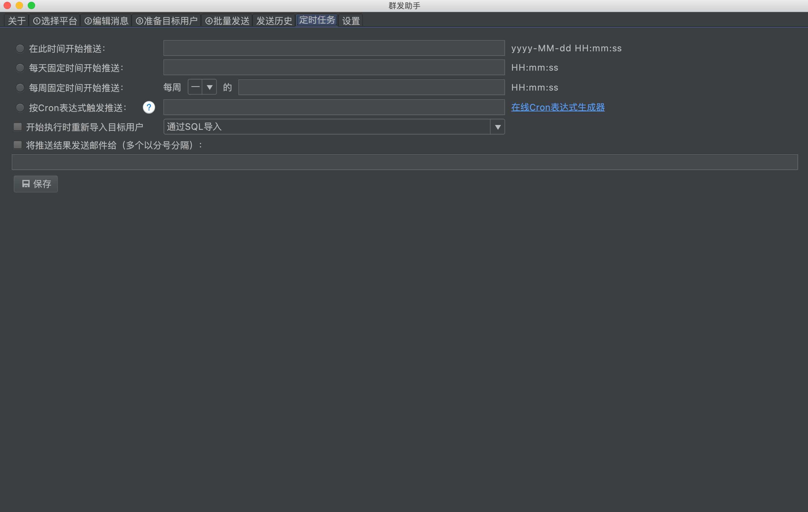
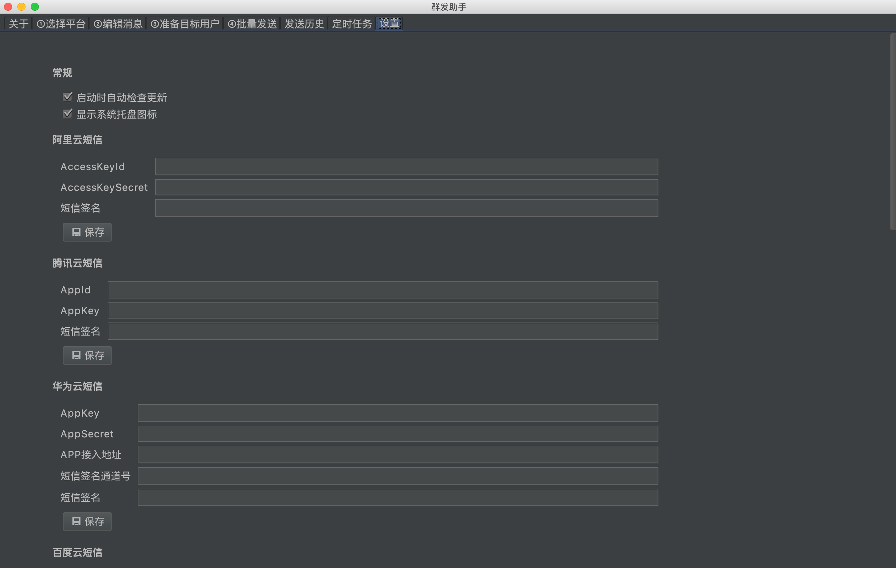
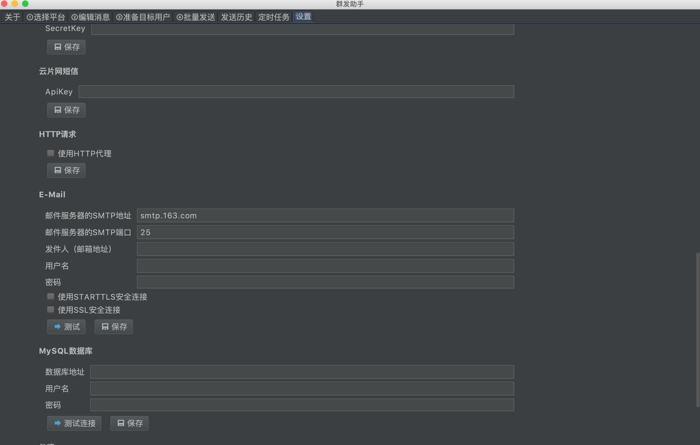

# 营销助手解决方案

文档由青岛前途软件技术有限公司(http://www.qdqtrj.com)提供

目录：
[TOC]

## 一、需求概述

实现短信、彩信、邮件群发的一款通用群发工具

## 二、设计要求

### 1、 特性要求：
1. 支持多个短信平台，后期可扩展平台，支持平台对接设置的快速配置
2. 支持邮件批量发送
3. 支持自定义消息内容并批量推送
4. 支持变量消息（可实现根据发送目标用户不同每条消息内容不一样）
5. 支持消息编辑、预览、消息管理
6. 支持通过文件导入用户（txt、csv、excel）
7. 支持通过MySQL导入用户
8. 支持各种粒度的定时推送，基于cron表达式
9. 支持推送历史查看
10. 支持推送结果邮件通知
11. 支持彩信批量发送，和扩展对接其他彩信平台

### 3、管理后台：
1. 管理登录用户
2. 用户发送记录和统计
3. 设置发送数量限制
4. 快捷登录各平台账号，以查看余额、管理模版等操作

### 2、对接短信平台：
1. 阿里云短信
2. 腾讯云短信
3. 华为云短信
4. 百度云短信
5. 又拍云短信
6. 七牛云短信
7. 云片网短信
> 架构需支持对接其他平台，以上为初步对接的短信平台

### 2、对接彩信平台：
根据客户需求选择对接平台

### 3、对接邮件平台：
1. 163
2. 腾讯企业邮箱

说明：
1. 每个平台内容审核力度不同，如发送擦边球性质的内容请多尝试更换平台。
2. 以上平台可通过使用购买或使用他人身份证注册公司来通过平台的账号审核，如非违法用途可采用任意公司在平台注册开通即可
3. 如需支持国外短信、彩信平台，请提供相关开发账号或资料。
4. 发送短信、彩信价格因平台而异，充值也是直接充给第三方平台，本工具对此不做限制。

## 三、架构分析

说明：
1. 如涉法律风险业务，小型服务可采用购买nas设备搭建，在国外运行，如国外网络80端口被封禁（国内封禁且无公网IP，也可以通过其他端口绕过）可采用frp穿透解决，则无需国内公司的申请服务器和备案等操作。
2. 信息发送大概路径：从桌面端软件所在的pc，向国内第三方短信平台发起请求后，由平台来对接运营商发送到用户手机的。
3. 管理端和web服务程序不发送短信，仅作为账号管理、设置发送数量限制、查看发送历史和统计的用途。

## 四、界面初步设计

### 1. 客户端

### 2. 管理端

> 以上是界面初步设计样式，以实际最终交付软件为准。

## 五、技术选型

  - 软件形式：
    - 桌面端软件
    - 需安装（可设置安装口令）
  - 开发技术：
    - java8
    - swing
    - mysql
    - mybatis
    - http
    - redis
    - lombok、线程池、定时任务、连接池等

## 六、其他

### 1、付款节点

 阶段序号 | 主要任务
:-|:-
1| 确认需求文档, 签订开发合同
2| 第一次付款
3| 确认设计方案
4| 前期资料准备
5| 第二次付款
6| 研发和开发阶段...
7| 集中测试阶段...
8| 第三次付款
9| 切换生产环境，上线试运营
10| 新BUG修复，功能完善
11 | 项目验收
12| 付尾款
13| 项目代码和文档的交付
14| 运维，技术支持

### 2、 退款条件

1. 最终交付软件和需求分析和解决方案文档不符
2. 乙方采用侵权技术导致甲方存在潜在法律风险
3. 乙方没能按时完成软件开发和交付工作
4. 退款金额：如未达到以上任意一条，退还全部款项

### 3、项目周期

开发时间：2个月内完成软件交付（可根据甲方要求加快开发，缩短交付时间）
免费运维时间：1年
免费运维内容：bug修复、保证系统可用性、提升性能、二次开发技术支持

### 4、交付内容
1. 软件本体
    - 可运行的批量发送短信、彩信客户端
      - windows版本（windows7以上平台，xp不做测试）
      - macos版本
      - 常见linux桌面发行版版本
    - 可运行的基于浏览器访问的管理后台
2. 所有源码
    - 客户端源码
    - 后台源码
    - 数据库初始化脚本
3. 文档
    - 二次开发说明书
    - 部署说明书

